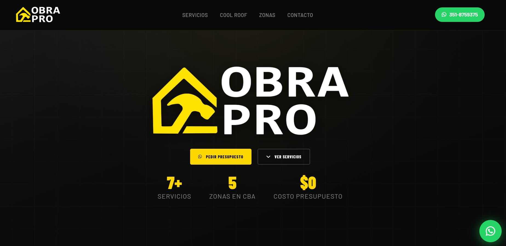

# ObraPro — Landing Page Profesional

Sitio web de una sola página para **ObraPro**, empresa de servicios especializados con cobertura en Córdoba, Argentina.

---

## Vista previa



> Diseño dark con acentos dorados, enfocado en conversión y contacto directo por WhatsApp.

---

## Sobre el proyecto

Landing page desarrollada para presentar los servicios de ObraPro, generar confianza en el cliente y dirigir el tráfico hacia WhatsApp como canal principal de contacto.

**Secciones incluidas:**
- Hero con estadísticas clave y CTAs principales
- Grilla de 7 servicios con animaciones al hacer scroll
- Sección educativa sobre tecnología Cool Roof
- Por qué elegirnos (4 pilares de valor)
- Zonas de cobertura en Córdoba
- CTA final + botón flotante de WhatsApp

---

## Stack tecnológico

| Tecnología | Uso |
|---|---|
| **HTML5** | Estructura semántica |
| **CSS3** | Diseño completo: variables, Grid, Flexbox, animaciones |
| **JavaScript (ES6+)** | Interactividad, IntersectionObserver, scroll |
| **Font Awesome 6.5** | Iconografía (vía CDN) |
| **Google Fonts** | Tipografías Barlow y Barlow Condensed (vía CDN) |

Sin frameworks, sin dependencias de Node, sin proceso de build. Un solo archivo HTML listo para desplegar.

---

## Características técnicas

- **Diseño responsive** con breakpoints en 820px y 480px
- **Tipografía fluida** con `clamp()` para escalado automático entre dispositivos
- **CSS Custom Properties** para theming centralizado
- **IntersectionObserver API** para animaciones on-scroll sin librerías externas
- **Animaciones CSS** con `@keyframes`: entradas, pulse en WhatsApp, hover en cards
- **Integración WhatsApp** con mensaje pre-escrito vía `wa.me`
- Archivo único de ~34 KB, sin overhead de frameworks

---

## Paleta de colores

```
--yellow:     #FFD700   (acento principal dorado)
--black:      #080808   (fondo primario)
--gray-dark:  #141414   (fondo secundario)
--gray-mid:   #1f1f1f   (fondo de cards)
--white:      #ffffff   (texto principal)
--wa:         #25D366   (verde WhatsApp)
```

---

## Estructura del proyecto

```
ObraPro/
├── index.html        # Sitio completo (HTML + CSS + JS)
├── readme.md
└── assets/
    ├── favicon.png
    └── logo.png
```

---

## Cómo usar

No requiere instalación ni dependencias. Solo abrir `index.html` en cualquier navegador moderno o desplegar el directorio en cualquier hosting estático (Netlify, Vercel, GitHub Pages, etc.).

---

## Proceso de desarrollo

Este proyecto fue desarrollado en colaboración con **[Claude Code](https://claude.ai/code)**, el CLI de Anthropic, marcando mi **primera experiencia trabajando con un agente de IA dentro del editor**.

Fue un proceso de aprendizaje muy valioso: pude iterar sobre diseño, estructura y código de manera conversacional, recibiendo sugerencias en tiempo real directamente en el contexto del proyecto. La dinámica de trabajo con Claude Code aceleró significativamente tanto la toma de decisiones de diseño como la escritura y revisión del código.

---

## Desarrolladora

**María Florencia Gala**
Portfolio: [mariaflorenciagala.netlify.app](https://mariaflorenciagala.netlify.app/)

---

*ObraPro © 2026 — Profesionales en Cada Detalle*

---

